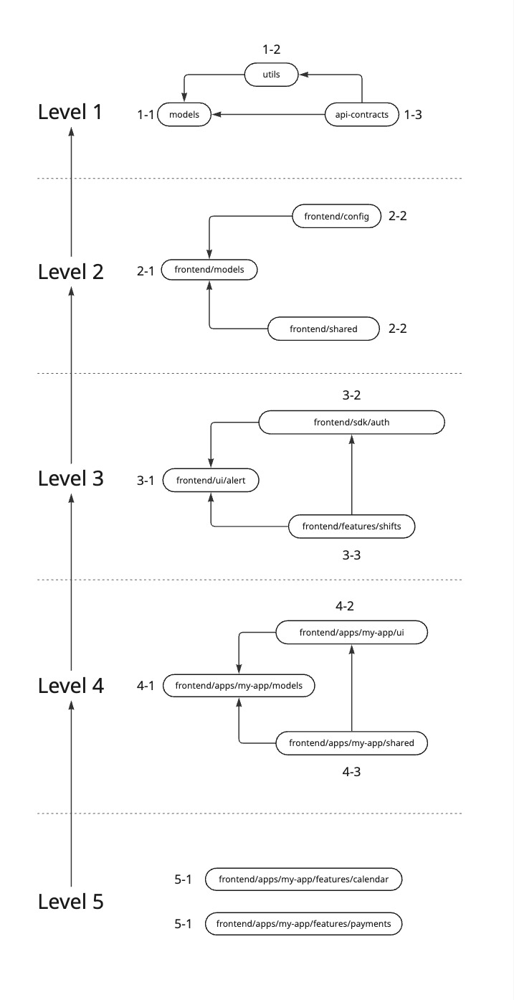

# Library Boundaries Convention

- Status: draft
- Date: 2025-09-13
- Tags: doc, project-structure, module-boundaries
- Deciders: Frontend Architecture Working Group (proposed)

Technical Story: Standardize import boundaries in the Nx monorepo to reduce coupling, speed up builds, and clarify ownership.

---

## Context

We operate a large Nx monorepo with multiple frontend and backend apps, many shared libraries,
application-specific libraries, and independent libraries. Over time, cross-feature imports,
deep imports, imports using relative paths will lead to coupling. That hurts:

- parallelization (affected/implicit rebuilds),
- testability and replaceability,
- tree-shaking and bundle size,
- clear ownership and review scope.

We need a simple, enforceable boundary model that:

- defines layers with clear responsibilities,
- prescribes allowed directions of dependency,
- is lint-enforced and visible in CI,
- leaves an explicit escape hatch (documented exceptions via adapters).


## Decision

### 1. Import control via composite `level:M-S` tags

Each library gets exactly one ordering tag: `level:<major>-<sub>`

`major` = vertical band (1..5), \
`sub` = ordered position inside the band (1..n).

**Rule**: a project at `level:M-S` may import only:
- any lower major level: `level:(1..M-1)-(any)`, and
- lower sublevels in the same major: `level:M-(1..S-1)`.

**Forbidden**: importing the same or higher sublevel within the same major, or any higher major.

To make the dependency matrix real, every project must be unambiguously classified and tooling-enforced.

#### Minimal project tags (example):
```json
{
  "name": "fe-features-shifts",
  "tags": ["type:lib","scope:fe","level:4-1","domain:shifts"]
}
```

### 2. Allowed Dependencies Matrix

This table mirrors the policy above. Enforcement is driven by level:M-S.
The table below shows the allowed dependencies between architectural layers. The vertical axis (Dependent Layer) represents
the layer that is importing, and the horizontal axis represents the layers that can be imported.

| **Dependent Layer** | `@models` | `@utils` | `@shared` | `@config` | `@ui` | `@sdk/*` | `@features/*` | `@apps/*` |
|:--------------------|:---------:|:--------:|:---------:|:---------:|:-----:|:--------:|:-------------:|:---------:|
| **`@apps/*`**       |     ✅    |    ✅    |     ✅    |     ✅   |   ✅   |    ✅     |       ✅       |     X     |
| **`@features/*`**   |     ✅    |    ✅    |     ✅    |     X    |   ✅   |    ✅     |       X       |     X     |
| **`@sdk/*`**        |     ✅    |    ✅    |     X     |     X    |   ✅   |    X     |       X       |     X     |
| **`@ui`**           |     ✅    |    ✅    |     X     |     X    |   X   |    X     |       X       |     X     |
| **`@config`**       |     ✅    |    ✅    |     X     |     X    |   X   |    X     |       X       |     X     |
| **`@shared`**       |     ✅    |    ✅    |     X     |     X    |   ✅   |    X     |       X       |     X     |
| **`@utils`**        |     ✅    |    X     |     X     |     X    |   X   |    X     |       X       |     X     |
| **`@models`**       |     X     |    X     |     X     |     X    |   X   |    X     |       X       |     X     |

_For example, the table shows that `@apps/*` can import from any layer except other `@apps/*`, while `@ui` can only depend on `@models` and `@utils`._


### 3. Tag Schema

**type**: `lib` | `app` \
**scope**: `fe` | `be` | `shared` \
**level**: `1-1` | `1-n` | `2-1` | `2-n` | `3-1` | `3-n` | `4-1` | `4-n` | `5-1` | `5-n`, where `n` is any integer number


### 4. Project Structure Schema
```
├── apps/
│   ├── frontend/ (dir)                                                        |  # All frontend apps
│   │   ├── my-app/ (dir)                                                      |  
│   │   │   ├── web (app)                                                      |  # WEB application
│   │   │   │   └── src/                                                       |  
│   │   │   │       ├── api/                                                   |  # Implements API calls (e.g. via HTTP)
│   │   │   │       │   └── any.api.ts                                         |  
│   │   │   │       ├── components/                                            |  
│   │   │   │       │   └── example/                                           |  
│   │   │   │       │       ├── example.component.ts                           |  
│   │   │   │       │       ├── example.component.html                         |  
│   │   │   │       │       ├── example.component.scss                         |  
│   │   │   │       │       └── example-component.service.ts                   |  
│   │   │   │       ├── config/                                                |  
│   │   │   │       │   └── app-routes.config.ts                               |  
│   │   │   │       ├── dialogs/                                               |  # Dialog component and dialog related classes
│   │   │   │       │   └── info                                               |  
│   │   │   │       │       ├── info.dialog.ts                                 |  
│   │   │   │       │       └── info-dialog.service.ts                         |  
│   │   │   │       ├── directives/                                            |  
│   │   │   │       │   └── any.directive.ts                                   |  
│   │   │   │       ├── guards/                                                |  
│   │   │   │       │   └── any.guard.ts                                       |  
│   │   │   │       ├── mappers/                                               |  
│   │   │   │       │   └── any.mapper.ts                                      |  
│   │   │   │       ├── models/                                                |  
│   │   │   │       │   └── any.ts | any.model.ts                              |  
│   │   │   │       ├── features/                                              |  # Application level features (modules)
│   │   │   │       │   ├── auth/                                              |  
│   │   │   │       │   ├── chat/                                              |  
│   │   │   │       │   └── ...                                                |  
│   │   │   │       ├── pages/                                                 |  # Page module and other page-specific files
│   │   │   │       │   ├── marketplace/                                       |  
│   │   │   │       │   └── shifts/                                            |  
│   │   │   │       ├── pipes/                                                 |  
│   │   │   │       │   └── any.pipe.ts                                        |  
│   │   │   │       ├── providers/                                             |  # Dependency provider functions
│   │   │   │       │   └── any.provider.ts                                    |  
│   │   │   │       ├── resolvers/                                             |  
│   │   │   │       │   └── any.resolver.ts                                    |  
│   │   │   │       ├── services/                                              |  
│   │   │   │       │   ├── any.service.ts                                     |  
│   │   │   │       │   └── any.strategy.ts                                    |  
│   │   │   │       ├── store/                                                 |  
│   │   │   │       │   ├── app.actions.ts                                     |  
│   │   │   │       │   ├── app.state.ts                                       |  
│   │   │   │       │   ├── some.store                                         |  # Data-specific storage
│   │   │   │       │   └── some.repository.ts                                 |  # Data-specific repository
│   │   │   │       ├── tokens/                                                |  
│   │   │   │       │   └── any.token.ts                                       |  
│   │   │   │       └── tests/                                                 |  
│   │   │   │           ├── mocks/                                             |  # Global mocks
│   │   │   │           └── utils/                                             |  # Any test shared functionality / global test utils
│   │   │   │                                                                  |  
│   │   │   └── mobile/ (app)                                                  |  # Mobile application
│   │   │       └── src/                                                       |  
│   │   │           └── ...                                                    |  
│   │   │                                                                      |  
│   │   ├── dev-portal/ (app)                                                  |  
│   │   ├── dashboard/ (app)                                                   |  
│   │   └── ...                                                                |  
│   │                                                                          |  
│   └── backend/                                                               |  # All backend apps
│       ├── my-app/ (app)                                                      |  
│       └── ...
│
└── libs/
    1
    ├── api-contracts/ (lib)             |  type:lib  scope:shared  level:1-3  |  # Shared API contracts between frontend and backend
    ├── utils/ (lib)                     |  type:lib  scope:shared  level:1-2  |  # General pure helpers and utility functions (no side effects)
    ├── models/ (lib)                    |  type:lib  scope:shared  level:1-1  |  # Pure types
    ├── frontend/                        |                                     |  
    │   ├── @assets/                     |                                     |  # Global assets
    │   ├── @styles/                     |                                     |  # Global styles
    │   ├── features/                    |                                     |  # Domain-specific feature libraries
    1   2   3                            |                                     |  
    │   │   └── shifts/ (lib)            |  type:lib  scope:fe      level:3-3  |  
    │   │       ├── api/                 |                                     |  
    │   │       │   ├── in/              |                                     |  # Provides public functionalities exposed to other feature libs that depend on this feature library
    │   │       │   └── out/             |                                     |  # Implements dependencies for API calls (e.g. via HTTP)
    │   │       ├── shell/               |                                     |  # Shell container components, router configuration, and use case specific "smart/page" components
    │   │       ├── services/            |                                     |  # Business logic
    │   │       ├── store/               |                                     |  
    │   │       ├── ui/                  |                                     |  # Feature-library specific ui components
    │   │       └── ...                  |                                     |  
    │   │                                |                                     |  
    │   ├── apps/                        |                                     |  # Application-specific libraries
    │   │   ├── my-app/                  |                                     |  
    │   │   │   ├── @assets/ (dir)       |                                     |  # Application-specific assets
    │   │   │   ├── @styles/ (dir)       |                                     |  # Application-specific styles
    │   │   │   ├── features/            |                                     |  
    1   2   3   4   5                    |                                     |  
    │   │   │   │   ├── calendar/ (lib)  |  type:lib  scope:fe      level:5-1  |  
    │   │   │   │   └── ...              |  type:lib  scope:fe      level:5-1  |  
    1   2   3   4                        |                                     |  
    │   │   │   ├── models/ (lib)        |  type:lib  scope:fe      level:4-1  |  
    │   │   │   ├── ui/ (lib)            |  type:lib  scope:fe      level:4-2  |  
    │   │   │   └── ...                  |                                     |  
    │   │   └── ...                      |                                     |  
    │   │                                |                                     |  
    │   ├── sdk/                         |                                     |  # Use case agnostic independent libraries
    1   2   3                            |                                     |  
    │   │   ├── auth/ (lib)              |  type:lib  scope:fe      level:3-2  |  
    │   │   ├── analytics/ (lib)         |  type:lib  scope:fe      level:3-2  |  
    │   │   ├── dialogs/ (lib)           |  type:lib  scope:fe      level:3-2  |  
    │   │   ├── router/ (lib)            |  type:lib  scope:fe      level:3-2  |  
    │   │   └── ...                      |                                     |  
    1   2                                |                                     |  
    │   ├── models/ (lib)                |  type:lib  scope:fe      level:2-1  |  # All global models
    │   ├── config/ (lib)                |  type:lib  scope:fe      level:2-2  |  # Global configuration, tokens, etc.
    │   ├── shared/ (lib)                |  type:lib  scope:fe      level:2-2  |  # Global shared files
    │   │   ├── animations/ (dir)        |                                     |  
    │   │   ├── components/ (dir)        |                                     |  
    │   │   ├── providers/ (dir)         |                                     |  
    │   │   └── ...                      |                                     |  
    │   ├── ui/                          |                                     |  # Generic and configurable UI libraries
    1   2   3                            |                                     |  
    │   │   ├── alert/ (lib)             |  type:lib  scope:fe      level:3-1  |  
    │   │   ├── button/ (lib)            |  type:lib  scope:fe      level:3-1  |  
    │   │   └── ...                      |                                     |  
    1   2                                |                                     |  
    │   └── utils/ (lib)                 |  type:lib  scope:fe      level:2-1  |  # Use case agnostic utility functions
    │                                    |                                     |  
    └── backend/                         |                                     |  # All backend libraries
        └── ...                          |  type:lib  scope:be      level:*-*  |  
```


### 5. Enforcement (ESLint / @nx/enforce-module-boundaries)
Nx doesn’t compare numbers; it matches sets of tags. The composite level:M-S keeps rules unambiguous (one project ⇒ one rule).

```json
{
  "overrides": [
    {
      "files": ["*.ts"],
      "rules": {
        "@nx/enforce-module-boundaries": [
          "error",
          {
            "depConstraints": [
              {
                "sourceTag": "level:1-1",
                "onlyDependOnLibsWithTags": []
              },
              {
                "sourceTag": "level:1-2",
                "onlyDependOnLibsWithTags": [
                  "level:1-1"
                ]
              },
              {
                "sourceTag": "level:1-3",
                "onlyDependOnLibsWithTags": [
                  "level:1-1",
                  "level:1-2"
                ]
              },
              {
                "sourceTag": "level:2-1",
                "onlyDependOnLibsWithTags": [
                  "level:1-1",
                  "level:1-2",
                  "level:1-3"
                ]
              },
              {
                "sourceTag": "level:2-2",
                "onlyDependOnLibsWithTags": [
                  "level:1-1",
                  "level:1-2",
                  "level:1-3"
                ]
              },
              {
                "sourceTag": "level:2-3",
                "onlyDependOnLibsWithTags": [
                  "level:1-1",
                  "level:1-2",
                  "level:1-3",
                  "level:2-2"
                ]
              },
              {
                "sourceTag": "level:3-1",
                "onlyDependOnLibsWithTags": [
                  "level:1-1",
                  "level:1-2",
                  "level:1-3",
                  "level:2-2"
                ]
              },
              {
                "sourceTag": "level:4-1",
                "onlyDependOnLibsWithTags": [
                  "level:1-1",
                  "level:1-2",
                  "level:1-3",
                  "level:2-1",
                  "level:2-2",
                  "level:2-3",
                  "level:3-1"
                ]
              },
              {
                "sourceTag": "level:5-1",
                "onlyDependOnLibsWithTags": [
                  "level:1-1",
                  "level:1-2",
                  "level:1-3",
                  "level:2-1",
                  "level:2-2",
                  "level:2-3",
                  "level:3-1",
                  "level:4-1"
                ]
              }
            ],
            "allowCircularSelfDependency": false
          }
        ]
      }
    }
  ]
}
```


### 6. Module Boundaries Approach Visualization


## Consequences
### Positive
- Smaller, predictable dependency graph → faster CI and affected runs.
- Clearer reviews and ownership (tags)
